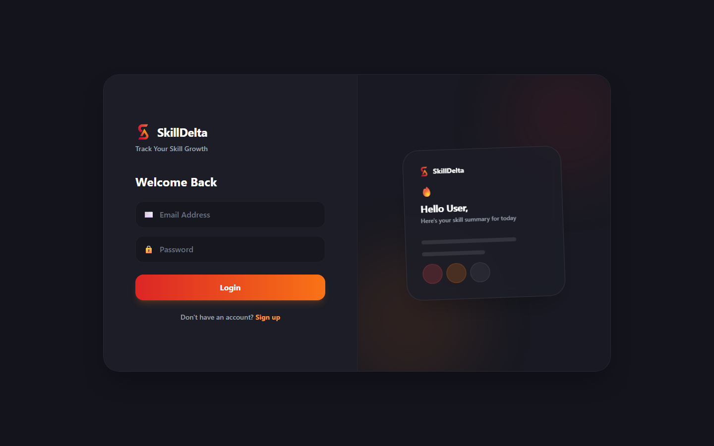
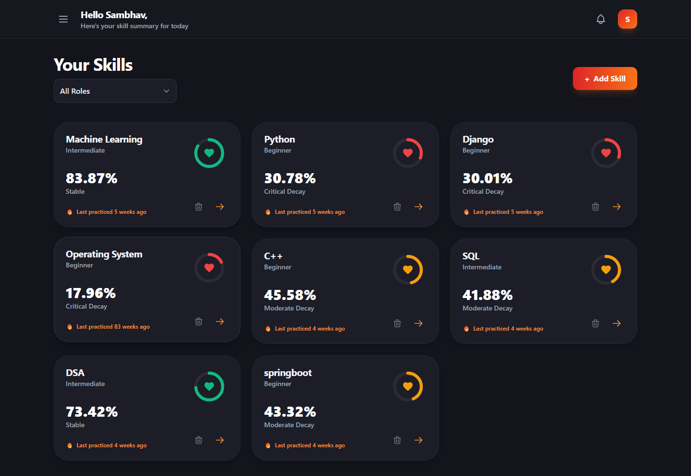

# 🎯 SkillDelta

SkillDelta is a modern full-stack application designed to help users track and manage skill development over time. It features a personalized dashboard that provides insights into learning progress with an intuitive, visually appealing interface.

**Live Demo:** [https://skilldelta.vercel.app](https://skilldelta.vercel.app)  
**Repository:** [SAMBHAV001-tech/SkillDelta](https://github.com/SAMBHAV001-tech/SkillDelta)

---

## 📸 Frontend Preview




---

## 🔧 Technology Stack

- **Frontend:** React 19, Vite, Tailwind CSS, Recharts
- **Backend:** FastAPI, Python 3.13, PostgreSQL (SQLAlchemy)
- **Document Processing & AI:** PyTesseract (OCR), PDFPlumber, Groq API
- **Deployment:** Vercel (Frontend), Docker + Render.com (Backend)

---

## 🗄️ Database Design

**Database:** PostgreSQL  
**ORM:** SQLAlchemy

### Key Entities
- **Users**: Authentication data and user profiles
- **Skills**: User skill tracking and progression progression logic
- **Documents**: Uploaded PDFs / OCR data for skill verification
- **Analysis Results**: AI processed output and feedback

### Relationships
- **User → Skills** (One-to-Many)
- **User → Documents** (One-to-Many)

*Note: The database is designed with structured schemas and proper indexing for fast and reliable query performance.*

---

## 📡 API Endpoints Section

FastAPI routes are logically structured and grouped into the following key domains:

- **Auth APIs**: User login, registration, and JWT token management.
- **Skill/Data APIs**: CRUD operations for skills, dynamic learning paths, and history tracking.
- **OCR / AI APIs**: Assessment processing, recommendation engines, predictive analytics, and natural language insights via Groq.

<details>
<summary><b>View Detailed Routes</b></summary>

- `1️⃣ Auth`
- `2️⃣ Skills`
- `3️⃣ Skill Analysis`
- `4️⃣ Recommendation`
- `5️⃣ Growth Analytics`
- `6️⃣ Prediction`
- `7️⃣ Assessment`
- `8️⃣ Practice`
- `9️⃣ Dashboard`
- `🔟 Reminder`
- `11️⃣ Skill History`
- `12️⃣ User`
- `13️⃣ Health`

</details>

---

## 🔗 API Documentation

* **Swagger UI:** `/docs`
* **ReDoc:** `/redoc`


---

## ⚙️ Scalability

- **FastAPI async scalability:** High-performance asynchronous endpoints configuration for I/O bounds.
- **PostgreSQL scaling:** Indexed structured relational schema for optimized querying.
- **Docker deployment:** Fully containerized backend for consistent environments and simple infrastructure scaling.
- **Future microservices architecture:** Decoupled design allows separation of Auth, Skill Mapping, and AI processing services.
- **Redis caching:** Prepared architecture to integrate Redis for caching frequently accessed user dashboards.
- **Load balancing:** API structure is stateless allowing easy distribution across multiple cloud instances via load balancers.

---

## 🚀 Getting Started

### 1. Clone the Repository
```bash
git clone https://github.com/SAMBHAV001-tech/SkillDelta.git
cd SkillDelta
```

### 2. Frontend Setup
```bash
cd frontend
npm install
npm run dev
```
The app will open at `http://localhost:5173/`.

### 3. Backend Setup
```bash
cd backend
python -m venv venv
# Windows: .\venv\Scripts\activate | Mac/Linux: source venv/bin/activate
pip install -r requirements.txt
uvicorn skillrot_app.main:app --host 0.0.0.0 --port 10000
```
API runs on port `10000`. 
Alternatively, use Docker: `docker run -p 10000:10000 $(docker build -q .)`

---

## 🔑 Demo Credentials

### Demo Credentials

Email: sambhavdas444@gmail.com
Password: test123

*(Note: For demo/testing purposes only)*

---

## 📊 Key Features
- ✨ Blazing-fast React frontend with a modern Tailwind CSS gradient design.
- 📚 Comprehensive document/PDF processing and analysis using Tesseract OCR.
- 🤖 Intelligent AI integration via the Groq API.
- 🔐 Secure JWT authentication & PostgreSQL database.

---

## 🤝 Contributing
We welcome contributions! Please create an issue or submit a pull request.

**Support & Docs:**
- Live Project: [https://skilldelta.vercel.app](https://skilldelta.vercel.app)
- Repo: [https://github.com/SAMBHAV001-tech/SkillDelta](https://github.com/SAMBHAV001-tech/SkillDelta)
